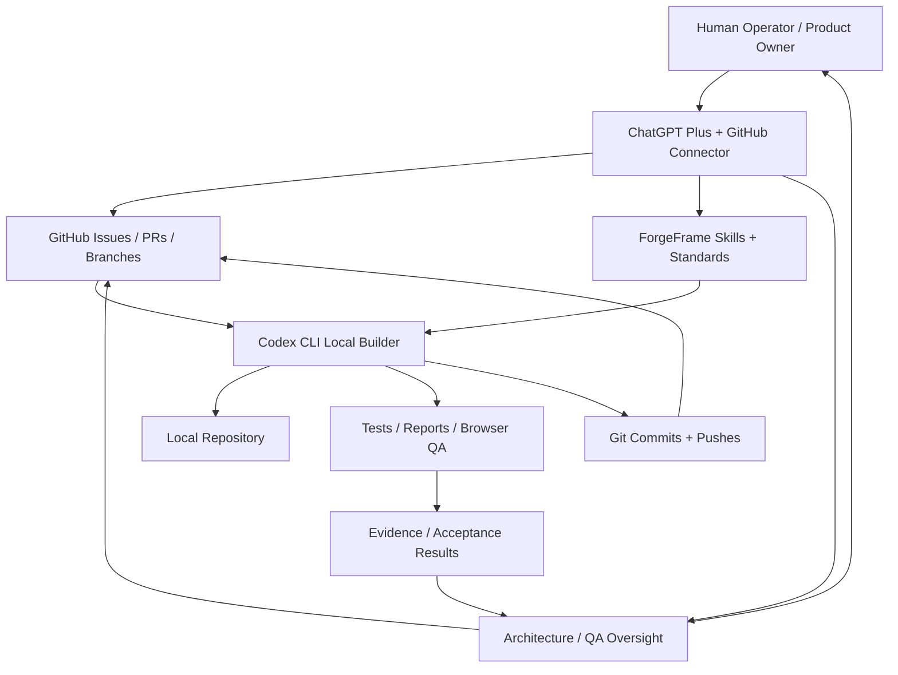
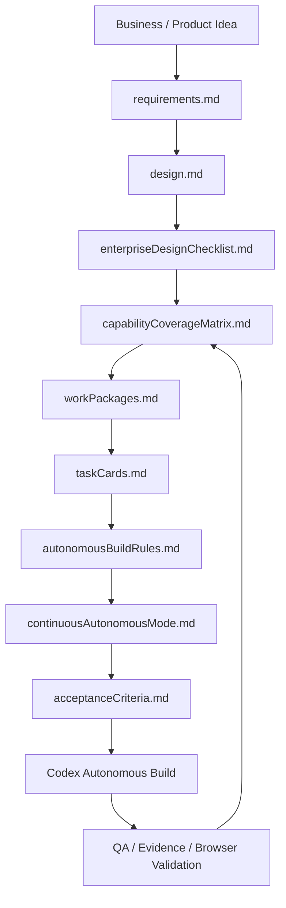
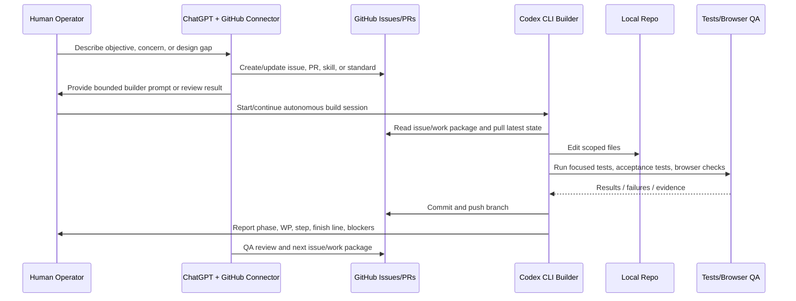

# ForgeFrame

**A Git-native framework for autonomous enterprise AI builds.**

ForgeFrame is a reusable repository template for building enterprise-grade applications with GPT-level architecture collaboration, Git-grounded operating doctrine, Codex CLI or similar coding agents, local development infrastructure, safety gates, task-card execution, continuous autonomous mode, enterprise UI/UX discipline, and acceptance-driven delivery.

It grew out of the CryptoBot V5 autonomous build program, where the process evolved from chat-driven coding into a repository-embedded framework for long-running AI software construction.

---

## Core idea

ForgeFrame turns a software project into an executable build doctrine.

Instead of asking an AI agent to “build the app” from a loose prompt, ForgeFrame gives the agent durable, version-controlled instructions:

```text
mission
architecture
requirements
design
enterprise design checklist
capability coverage matrix
work packages
task cards
autonomous build rules
continuous autonomous mode
extended task queue
acceptance criteria
stop gates
quality gates
runbooks
UI/UX standards
admin/config/metadata maintenance standards
phase/WP/step status rules
```

The result is a repeatable framework for enterprise application delivery where AI agents can build continuously while staying inside explicit safety, test, architecture, Git, configuration, data, UX, ML, operations, release, and governance boundaries.

---

## Why this matters

Autonomous coding agents are powerful, but they need structure.

Without structure, they drift:

```text
wrong scope
missing acceptance tests
premature implementation
unsafe assumptions
undocumented decisions
weak handoff between design and code
shallow enterprise coverage
inconsistent UI layouts
missing privilege/access controls
missing admin/config maintenance screens
weak backend/UI integration testing
one-task-and-stop execution
```

ForgeFrame embeds the structure directly in the repository so the agent operates from versioned instructions, not fragile chat memory.

---

## Operating model

ForgeFrame assumes three cooperating layers:

```text
1. ChatGPT Plus with GitHub connector
   Architecture, oversight, QA review, issue creation, PR review, standards updates, work-package design, and strategic direction.

2. Codex CLI or equivalent local coding agent
   Local autonomous build execution, file edits, tests, reports, commits, and pushes.

3. Git / GitHub workflow
   Durable source of truth for branches, issues, PRs, commits, work packages, decisions, review history, and release traceability.
```

ChatGPT is not used only as a chat assistant. In the ForgeFrame pattern, ChatGPT acts as a connected architecture/QA/oversight agent that can inspect GitHub state, create issues, update documentation, and guide the local builder.

Codex CLI is not used as an isolated coding assistant. It is the local builder that executes repository-controlled work packages under the rules and skills stored in the repo.

Git and GitHub are not just version control. They are the durable execution ledger for autonomous development.

---

## Architecture



---

## Agent responsibility split

| Agent / Tool | Primary Responsibility |
| --- | --- |
| Human operator | Business direction, approvals, risk decisions, final acceptance. |
| ChatGPT Plus + GitHub connector | Architecture, standards, QA review, issue creation, PR review, work-package design, oversight. |
| Codex CLI | Local implementation, test execution, generated reports, commits, and pushes. |
| Git/GitHub | Durable state, branches, issues, PRs, commits, review history, and release traceability. |
| Browser agent / agent-browser | UI/UX browser regression, console inspection, network/API validation, screenshot/interaction checks. |

---

## Framework layers

```text
Human / GPT collaboration layer
  -> vision, architecture, doctrine, review, correction

Git governance layer
  -> AGENTS.md, docs, work packages, task cards, acceptance criteria

Autonomous execution layer
  -> Codex CLI / coding agent builds task cards, runs tests, commits checkpoints

Local dev infrastructure layer
  -> local server, databases, services, test harnesses, logs, dashboards

Enterprise assurance layer
  -> safety gates, configuration, security, data governance, QA, observability, runbooks

UI/UX and admin governance layer
  -> screen inventory, workspace grids, report grids, privilege matrix, backend/UI tests, metadata/config maintenance
```

---

## Repository structure

```text
forgeframe-/
  README.md
  AGENTS.md
  docs/
    architecture.md
    gptCollaborationModel.md
    gitWorkflow.md
    codexCliWorkflow.md
    localDevServerWorkflow.md
    framework/
      forgeframeTemplate.md
      skills/
        README.md
        modelRoutingSkill.md
        gitBuildOpsSkill.md
        workPackageAuthoringSkill.md
        autonomousBuilderSkill.md
        safetyStopGateSkill.md
        evidencePipelineSkill.md
        dataSourceMappingSkill.md
        mlValidationSkill.md
        dashboardStatusAdapterSkill.md
        enterpriseUiDesignSkill.md
        adminMetadataMaintenanceSkill.md
        uiUxBrowserRegressionSkill.md
        architectureContextGraphSkill.md
        releasePromotionSkill.md
    externalReviews/
    paper/
      forgeframePaper.md
    blog/
      forgeframeBlogPost.md
  templates/
    requirements.md
    design.md
    enterpriseDesignChecklist.md
    capabilityCoverageMatrix.md
    workPackages.md
    taskCards.md
    autonomousBuildRules.md
    continuousAutonomousMode.md
    extendedAutonomousTaskQueue.md
    holisticCompletionReview.md
    acceptanceCriteria.md
    runbook.md
    uiDesign/
      screenInventory.md
      navigationMap.md
      rolePrivilegeMatrix.md
      workspaceGridStandards.md
      reportGridStandards.md
      backendUiIntegrationMatrix.md
      statusIndicatorModel.md
      adminMaintenanceMatrix.md
      browserRegressionPlan.md
  examples/
    cryptobotV5/
      README.md
  scripts/
    validateFramework.sh
```

---

## AI-collaborative planning artifacts

These files are not meant to be handwritten in isolation by the operator. They are intended to be fleshed out collaboratively with AI before and during autonomous development.

| Artifact | AI-Collaborative Purpose |
| --- | --- |
| `requirements.md` | Convert rough goals into functional, non-functional, security, data, UI, operational, and integration requirements. |
| `design.md` | Build the application architecture, module boundaries, data flows, APIs, UI structure, and operational model. |
| `enterpriseDesignChecklist.md` | Ensure enterprise completeness: auth, roles, audit, logging, config, monitoring, backups, deployment, support, and maintainability. |
| `capabilityCoverageMatrix.md` | Map requirements to implemented capabilities, tests, screens, APIs, reports, and known gaps. |
| `workPackages.md` | Group work into bounded packages that an autonomous builder can execute safely. |
| `taskCards.md` | Break work packages into concrete implementation tasks with files, tests, acceptance criteria, and stop gates. |
| `autonomousBuildRules.md` | Define how Codex/agents operate, what they may edit, how they test, and when they must stop. |
| `continuousAutonomousMode.md` | Define when agents continue automatically through TODO work and when they stop for operator approval. |
| `acceptanceCriteria.md` | Define what proves the system is complete, correct, safe, testable, usable, and production/shadow/live ready. |

The operator provides intent and judgement. AI helps expand the artifacts into a complete enterprise build plan. The repository then becomes the source of truth for autonomous execution.

---

## Planning flow



---

## Build execution flow



---

## Required builder status reporting

Every major builder update must report:

```text
Total phase status
Current phase
Current work package
Current step
Finish line
Remaining work
Blocking gates
Branch
Model/reasoning level if known
```

The builder must continue through TODO work packages when:

```text
tests pass
worktree is clean
scope is clear
no stop gate is hit
no operator approval is required
```

The builder must stop when:

```text
stop gate is declared
operator approval is required
tests fail and cannot be resolved in scope
unsafe config is required
secrets risk exists
generated artifact risk exists
queue state is ambiguous
finish line is ambiguous
```

---

## Enterprise capability coverage

ForgeFrame explicitly prompts each autonomous project to account for:

```text
API design and construction
security and access control
certificates, DNS, and networking
package and environment setup
configuration and parameter control
UI/UX design, mockups, workspace grids, report grids, admin screens, chat interfaces, multimedia, and voice
database schemas and data model design
metadata, master data, lookup data, reference data, and maintenance surfaces
ETL and data pipelines
vector databases, RAG, and memory frameworks
ML integration and model promotion
reports and analytics
debug, error handling, structured logging, and log levels
monitoring, observability, self-healing, and self-improvement
token optimization and AI cost control
performance tuning
work-package dependencies and parallel coding-agent execution
QA, regression, acceptance, browser, and UX testing
cost modelling
Git, release management, backup, recovery, retention, archiving, and disposition
production promotion, runbooks, documentation, and rollback
```

Each item must be implemented, tested, documented, accepted, declared not applicable, or explicitly deferred with a known limitation.

---

## Enterprise UI/UX requirements

AI-generated UI must not be accepted until the design includes:

```text
screen inventory
navigation map
role/privilege matrix
workspace grid standards
report grid standards
status indicator model
backend/UI integration matrix
admin/config/metadata maintenance matrix
browser regression plan
```

Every UI must define:

```text
login/session behavior
role-based visibility
authorized and forbidden paths
status indicators
loading/empty/error/degraded states
backend/API contracts
browser validation path
sensitive-value redaction
read-only vs control mode
```

This is required because AI often creates pages that render but are not consistent, complete, intuitive, secure, or operationally usable.

---

## Admin / metadata / lookup maintenance requirements

Any table or file that drives application behavior must have a maintenance strategy:

```text
configuration files
configuration tables
metadata tables
lookup/code tables
feature flags
rule tables
threshold tables
model/promotion policies
status/severity codes
scheduler/control rows
report definitions
UI menu definitions
role/permission mappings
```

If a driving table exists without a maintenance UI/API/admin command, the build must raise:

```text
DRIVING_TABLE_WITHOUT_MAINTENANCE_UI
```

---

## Quick start

Use ForgeFrame to start a new autonomous build project:

```bash
mkdir my-enterprise-app
cd my-enterprise-app

# copy the ForgeFrame templates into the new repo
cp -r ../forgeframe-/templates ./docs
cp ../forgeframe-/AGENTS.md ./AGENTS.md
```

Then customize the planning artifacts collaboratively with AI:

```text
requirements.md
design.md
enterpriseDesignChecklist.md
capabilityCoverageMatrix.md
workPackages.md
taskCards.md
autonomousBuildRules.md
continuousAutonomousMode.md
acceptanceCriteria.md
```

Start the agent with:

```text
Read AGENTS.md, docs/enterpriseDesignChecklist.md, docs/capabilityCoverageMatrix.md, docs/workPackages.md, docs/taskCards.md, docs/autonomousBuildRules.md, and docs/continuousAutonomousMode.md. Continue the build autonomously from the first incomplete task card. Commit after each task. Stop only on mandatory stop gates.
```

---

## Design principles

1. **Git is the build memory.** Chat can guide, but the repository must hold the durable instructions.
2. **Task cards are execution units.** Every autonomous build task must have scope, deliverables, tests, and acceptance criteria.
3. **Continuous mode needs stop gates.** Autonomy should not mean blind execution.
4. **Safety defaults matter.** Production-impacting actions must be disabled by default.
5. **Tests are the agent's guardrails.** Each task must add or update tests.
6. **Architecture must be versioned.** The agent should never rely only on transient conversation context.
7. **Enterprise coverage must be explicit.** API, security, UI, data, ML, operations, QA, release, backup, and retention are design concerns, not afterthoughts.
8. **Completeness requires holistic review.** The framework must detect missing depth before final acceptance.
9. **UI/UX must be designed, not improvised.** The framework must force screen inventory, navigation, roles, grids, status, and browser validation.
10. **Driving data must be maintainable.** Config, metadata, lookup, threshold, and policy data require maintenance and audit paths.

---

## Project lineage

ForgeFrame was extracted from a live autonomous build effort for CryptoBot V5, where the framework evolved through real failures and improvements:

```text
single-task stopping -> continuous autonomous mode
broad work packages -> scoped task cards
missing ML detail -> ML training design
missing enterprise gaps -> holistic completion review and enterprise checklist
ad hoc prompting -> repository-embedded doctrine
missing UI consistency -> enterprise UI design standards
missing admin surfaces -> metadata/config maintenance standards
ambiguous queue state -> phase/WP/step reporting
metric gaming risk -> evidence and validation gates
```

---

## Status

Reusable framework seed with active hardening. The framework now includes core autonomous-build doctrine plus enterprise capability coverage templates. Newer reusable enhancements are being synchronized from the CryptoBot V5 reference implementation into this repository.

---

## Authors

Craig MacPherson / Arti Muse
